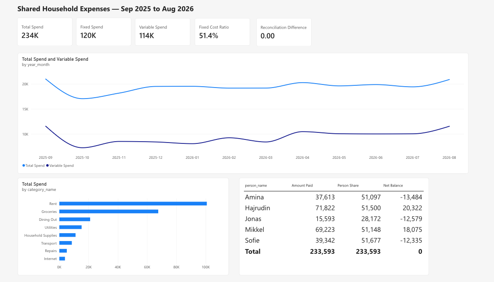
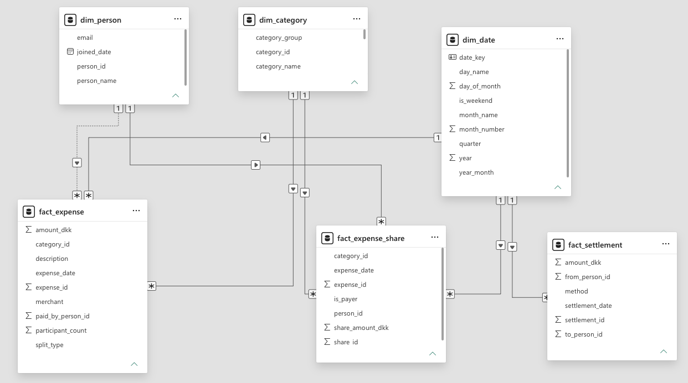

# Expense Analytics Dashboard

A Power BI report built on top of the [Roommate Expense Splitter API](https://github.com/hajrudin27) I wrote earlier this year. The API handles the logic of splitting shared costs between flatmates. This is the other half of the problem: taking a year of that data and turning it into something you can actually look at and get an answer from.



## Why I built it

I'd already written the backend, but the data just sat in a PostgreSQL database where it was no use to anyone who wasn't going to write SQL against it. I'd been reading about Power BI and the Power Platform and wanted to try it on something real instead of a tutorial dataset.

Tutorials hand you data that's already clean and a model that's already correct, so you never run into the parts that are actually difficult. I wanted to hit those parts.

## What the report answers

- Are we spending more than usual this month?
- Which categories actually drive the bill?
- What does living here cost me personally?
- Who owes who right now?
- Can I trust these numbers?

That last one sounds odd for a dashboard, but I ended up putting a data quality check directly on the report page. More on that below.

## What I found

I started with one line on a chart: total spend per month. It was almost completely flat, somewhere between 17,000 and 21,000 DKK every single month, and it told me nothing at all.

The reason turned out to be rent. It's 43% of everything the household spends and it's exactly the same number every month, so it flattens out everything else.

```
Rent                100,800 DKK    43.2%
Groceries            67,623 DKK    28.9%
Dining Out           21,100 DKK     9.0%
Utilities            15,280 DKK     6.5%
Household Supplies   11,135 DKK     4.8%
Transport             8,593 DKK     3.7%
Repairs               5,160 DKK     2.2%
Internet              3,902 DKK     1.7%
```

Three categories make up 81% of the total.

So I tagged every category as Fixed, Variable, Discretionary or Irregular, and wrote a `Variable Spend` measure that strips out the costs nobody can do anything about in a given month. Putting that on the same chart as the total is what made the year readable:

```
              total     variable    utilities   dining out
2025-10      17,056        7,260        1,080        1,314
2025-12      19,503        8,414        2,344        1,878
2026-01      19,524        8,070        2,716          778
2026-07      19,416       10,040          677        2,562
2026-08      20,880       11,547          590        2,232
```

Total spend swings **23%** across the year. Variable spend swings **59%**. So there's roughly two and a half times more movement than the headline number suggests, and underneath it there are two real seasonal patterns: the electricity bill is over four times higher in January than in August, and eating out drops to 778 DKK in January against a monthly average of about 1,750.

None of that is visible if you only plot the total.

## How the data is modelled

It's a star schema. Three dimensions, three fact tables, all relationships going one way from dimension to fact.

```
        dim_person        dim_category        dim_date
             │                 │                 │
    ┌────────┼────────┬────────┼────────┬────────┼────────┐
    │        │        │        │        │        │        │
fact_expense      fact_expense_share          fact_settlement
```

The two fact tables are at different grains on purpose. `fact_expense` has one row per expense, and `fact_expense_share` has one row per person per expense, which is what they personally owe. Most of the report points at the share table, because "who consumed this" is usually the question, not "whose card was in the reader".

### The bit I had to think about

A person is connected to an expense in two different ways. They consumed a share of it, and they may separately have paid for the whole thing. Those are different questions and they need different numbers.

I tried to set up both relationships and Power BI refused, because two active paths between the same two tables is ambiguous and it can't work out which one you mean. The fix is to leave one of them inactive and switch it on only inside the measure that needs it:

```dax
Amount Paid =
CALCULATE (
    SUM ( fact_expense[amount_dkk] ),
    USERELATIONSHIP ( fact_expense[paid_by_person_id], dim_person[person_id] )
)

Net Balance = [Amount Paid] - [Person Share]
```

I didn't know about `USERELATIONSHIP` before this project. What I'd have done otherwise is duplicate the person table, which works but leaves you maintaining two copies of the same thing.

If you get this wrong you don't get an error. You get a report where everybody's balance is zero, which looks completely fine and is completely wrong.

### Two other things that caught me out

**Bidirectional filtering.** Power BI created some of the relationships automatically and set them to filter both ways. That meant a filter could travel from `dim_category` up into one fact table and back down into `dim_date`, and also the other way round through the second fact table. Two paths between the same tables, so it threw an ambiguity error. Setting every relationship to single-direction fixed it, and it's the right setting anyway.

**Sorting.** My first version of the trend chart was sorted by value instead of by month, so the line sloped neatly downwards and looked like spending had fallen steadily all year. It hadn't. The months were just lined up by size. It's an easy one to miss because the chart looks convincing.

## Making sure the numbers are right

If you split an odd amount between three people there's a remainder, and if you ignore it the shares quietly stop adding up to the expense total. Over a year that's real money.

The split logic gives the remainder to the first participant, and I check it in three places:

1. The data generator asserts that shares reconcile before it writes anything
2. `v_dq_share_reconciliation` in SQL returns any expense whose shares don't sum to its total (it returns nothing)
3. A `Reconciliation Difference` card sits on the report itself

```
Total expenses : 233,593.45 DKK
Total shares   : 233,593.45 DKK
Balances sum to:        0.00 DKK
```

The balances summing to exactly zero is the real test. Money can move between flatmates but it can't appear out of nowhere, so if that number isn't zero something is broken.

I put the check on the report rather than hiding it in a test file because the person reading the dashboard is the one who needs to know whether to trust it.



## What's in here

```
data/            Six CSVs - the raw tables
sql/             Schema, seed data, and the reporting views
powerbi/         ExpenseAnalytics.xlsx (all six tables in one workbook)
                 measures.dax - every measure, commented
                 MODEL_SETUP.md - how to rebuild the report
scripts/         Data generator and the CSV -> SQL / CSV -> Excel converters
docs/            Screenshots
```

## Running it

Power BI Desktop is Windows only and I'm on a Mac, so I built this in the browser version at [app.powerbi.com](https://app.powerbi.com). That worked fine, with one catch: uploading CSVs there creates a separate semantic model per file, which makes relationships impossible. Uploading a single Excel workbook with all the tables in it gets you one model, which is what you want. That's why `ExpenseAnalytics.xlsx` exists.

Load that file, then follow [`powerbi/MODEL_SETUP.md`](powerbi/MODEL_SETUP.md).

If you'd rather run it against a real database:

```bash
createdb expenses
psql -d expenses -f sql/01_schema.sql
psql -d expenses -f sql/02_seed_data.sql
psql -d expenses -f sql/03_reporting_views.sql

# should return zero rows
psql -d expenses -c "SET search_path TO analytics; SELECT * FROM v_dq_share_reconciliation;"
```

To regenerate the data:

```bash
python3 scripts/generate_data.py
python3 scripts/make_seed_sql.py
python3 scripts/make_excel.py
```

The generator uses a fixed seed, so you get identical output every time and the CSVs and SQL never drift apart.

## About the data

The transactions are generated, not real. Danish shops and DKK amounts, groceries weighted towards weekends, electricity that climbs through the winter, eating out that drops during exam months, and a fifth flatmate who moves in halfway through the year.

I used generated data because publishing a year of my actual flatmates' spending isn't mine to publish. The modelling, the SQL and the DAX would be identical either way.

## What I'd do differently

- The settlements table is in the model but nothing much uses it yet. Working out who should pay who, and in the fewest transfers, is a nicer problem than it looks and I'd like to come back to it.
- Right now the report reads from a static file. Connecting Power BI straight to the PostgreSQL database would be closer to how this works in practice.
- I'd like to try rebuilding the whole thing as a Power App, so adding an expense and seeing the dashboard update are the same tool.

## Built with

PostgreSQL, Power BI, DAX, Python

---

Built in August 2026. I'm a Software Technology student at SDU, mostly a backend person, using this to get properly into the BI side of things.
